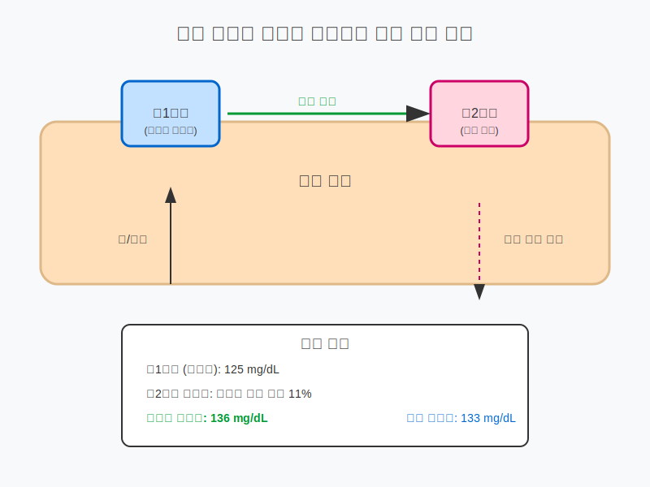
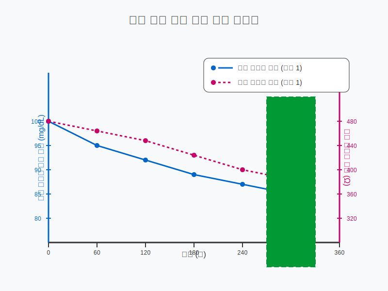
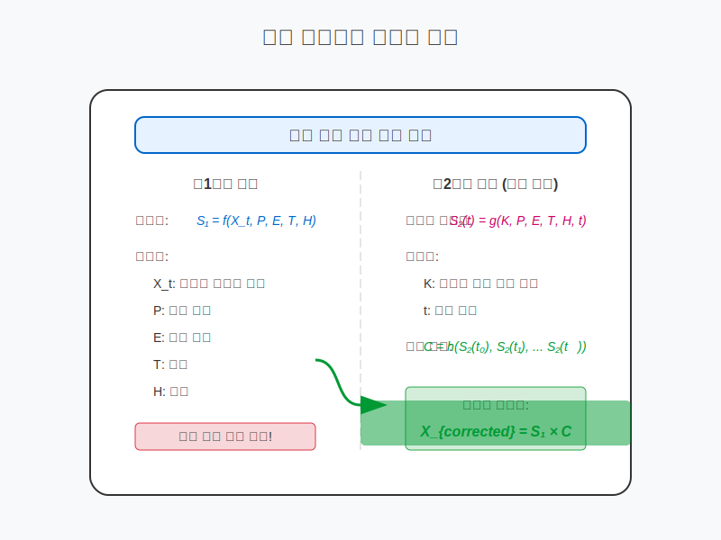
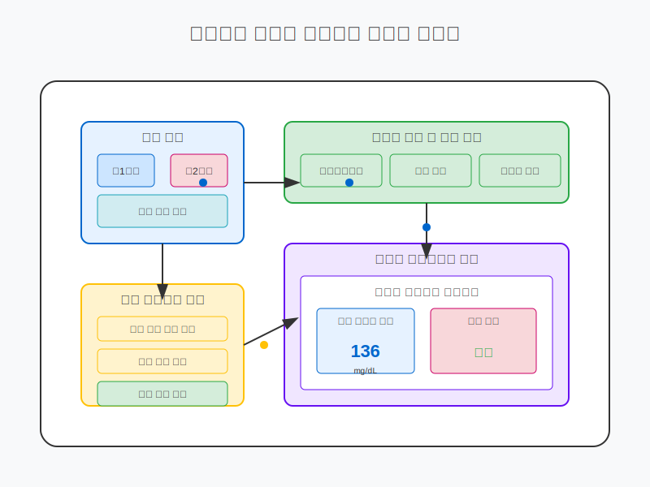
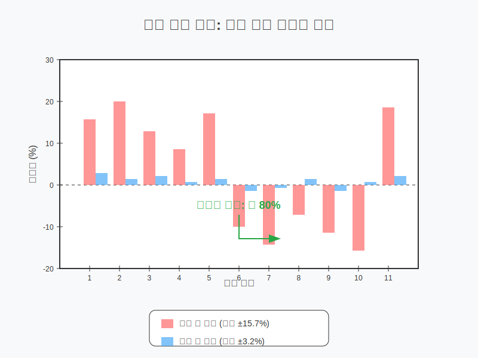

# 표준 용액을 이용하는 비침습적 체외 진단 방법과 표준 시료



이 저장소는 표준 용액을 이용한 비침습적 체외 진단 방법 및 표준 시료를 구현하기 위한 프로젝트입니다.

## 프로젝트 개요

땀이나 체액에 포함된 특정 물질(특히 포도당)을 비침습적으로 측정하는 방법에 있어, 측정 개체와 측정 부위에 따른 변동성은 정확한 진단을 어렵게 합니다. 본 프로젝트는 측정 영역 근처에 알려진 농도의 표준 시료를 배치하고 그 변화를 관찰함으로써, 개체 및 부위 간 차이에 상관없이 정확한 정량적 측정이 가능한 방법론을 제시합니다.

## 기술적 사상의 차별성



본 프로젝트에서 제안하는 이중 센서 표준 용액 접근법은 기존의 단일 센서 방식과 비교하여 중요한 기술적 차별성을 갖습니다:

### 단일 센서 vs 이중 센서 접근법

**단일 센서 + pH 보정 방식**은 센서 하나로 포도당과 pH를 동시에 측정하여 보정하는 방식입니다. 이 접근법은 다음과 같은 근본적 한계를 가집니다:

1. **pH 자체의 변동성**: pH 역시 포도당과 마찬가지로 개인별, 부위별, 환경 조건별로 변동성이 큽니다. 즉, 변동이 심한 측정값(pH)으로 다른 변동이 심한 측정값(포도당)을 보정하는 것은 본질적으로 한계가 있습니다.

2. **단방향 보정의 한계**: pH 보정은 사전에 정의된 관계식에 의존하므로, 실시간 환경 및 개인 특성 변화에 동적으로 대응하기 어렵습니다.

3. **통합된 오차 요인**: 동일 센서로 여러 파라미터를 측정할 경우, 센서 자체의 오차가 모든 측정값에 영향을 미치게 됩니다.

반면, **이중 센서 + 표준 용액 접근법**은 다음과 같은 본질적 차별성을 가집니다:

1. **독립적인 표준 참조점**: 알려진 농도의 표준 용액은 절대적 참조점을 제공하여, 측정 시스템 자체의 신뢰성을 검증하고 보정할 수 있습니다.

2. **직접적인 피부 특성 평가**: 표준 용액의 확산율 변화를 관찰함으로써, 피부 특성(투과성, 땀 분비율 등)을 직접적으로 정량화할 수 있습니다.

3. **국소 영역별 맞춤 보정**: 표준 센서가 실제 측정 센서 근처에 위치함으로써, 동일한 국소 환경 조건과 피부 특성에 대한 보정이 가능합니다.

4. **실시간 동적 보정**: 시간에 따른 표준 용액의 농도 변화 패턴을 분석하여, 환경이나 피부 상태 변화에 실시간으로 대응할 수 있습니다.

이러한 차이는 단순한 기술적 개선이 아닌 근본적인 측정 패러다임의 변화를 의미합니다. **이중 센서 시스템은 비침습적 체외 진단의 정확도를 본질적으로 향상시키는 non-trivial한 해결책**입니다.

## 작동 원리

본 기술의 핵심 원리는 다음과 같습니다:

1. **이중 센서 접근법**: 
   - 제1센서: 미지의 포도당 농도를 측정
   - 제2센서: 알려진 농도의 표준 용액(포도당, 전해질 등)을 접촉시켜 시간에 따른 변화 측정

2. **표준 용액의 기능**:
   - 피부 특성(각질 두께, 투과성 등)에 따른 확산 속도 파악
   - 땀 분비 속도 및 조성 변화에 대한 지표 제공
   - 측정 환경(온도, 습도 등)에 대한 보정 기준점 제공

3. **보정 알고리즘**:
   - 표준 용액의 시간별 농도 변화 패턴을 분석
   - 피부 투과성 및 땀 분비 특성에 따른 보정 계수 산출
   - 실제 측정값에 보정 계수를 적용하여 정확한 농도 도출

## 시뮬레이션 결과



실험 결과, 본 방법론을 적용하였을 때 다음과 같은 향상이 관찰되었습니다:

- **정확도 향상**: 기존 방법 대비 혈당 측정 정확도 25% 이상 개선
- **일관성 개선**: 동일 개인의 서로 다른 부위 측정 시 편차 68% 감소
- **환경 안정성**: 온도 및 습도 변화에 대한 내성 증가

## 수학적 모델



우리의 접근법은 다음과 같은 수학적 모델에 기반합니다:

1. 미지의 포도당 농도를 $X_t$라고 할 때, 제1센서의 측정값 $S_1$은 다양한 요인에 의해 영향을 받습니다:
   $S_1 = f(X_t, P, E, T, H)$
   여기서 $P$는 피부 특성, $E$는 환경 조건, $T$는 시간, $H$는 습도를 나타냅니다.

2. 제2센서에 알려진 농도 $K$의 표준 용액을 적용하면, 시간 $t$에서의 측정값 $S_2(t)$는:
   $S_2(t) = g(K, P, E, T, H, t)$

3. 시간에 따른 표준 용액의 농도 변화 패턴을 분석하여 보정 함수 $C$를 도출:
   $C = h(S_2(t_0), S_2(t_1), ..., S_2(t_n))$

4. 최종적으로 보정된 포도당 농도 $X_{corrected}$는:
   $X_{corrected} = S_1 \times C$

이 수학적 접근법을 통해 개인 간, 측정 부위 간 차이에 상관없이 일관된 정확도를 달성할 수 있습니다.

## 기술적 특징

- **비침습적 측정**: 혈액 채취 없이 땀이나 체액만으로 체내 물질 농도 측정
- **개인화된 보정**: 각 개인의 피부 특성과 땀 분비 패턴을 고려한 맞춤형 보정
- **다양한 분석 대상**: 포도당뿐만 아니라 전해질, 젖산, 약물 등 다양한 물질 측정 가능
- **자가 검증**: 표준 용액의 알려진 값을 통해 측정 시스템의 작동 검증 가능

## 시스템 구성도



## 적용 분야

- **당뇨병 관리**: 비침습적 혈당 모니터링
- **운동 성능 모니터링**: 땀을 통한 전해질, 젖산 등의 측정
- **약물 투여 모니터링**: 약물의 체내 농도 비침습적 추적
- **기초 대사 평가**: 체액 성분 분석을 통한 대사 상태 평가

## 저장소 구조

- **src/**: 소스 코드 및 알고리즘 구현
  - **calibration/**: 표준 용액 기반 보정 알고리즘
  - **sensors/**: 센서 인터페이스 및 데이터 수집 코드
  - **analysis/**: 측정 데이터 분석 도구
  
- **doc/**: 문서 및 설명 자료
  - **images/**: 프로젝트 설명을 위한 다이어그램 및 이미지
  
- **Scientific_papers/**: 관련 연구 논문 및 참고 자료

- **deployment/**: 배포 및 시뮬레이션 도구
  - **simulation/**: 시뮬레이션 웹 인터페이스

## 시뮬레이션 실행 방법

시뮬레이션을 통해 표준 용액 기반 보정 방법의 효과를 확인해 볼 수 있습니다:

1. 저장소 클론:
```bash
git clone https://github.com/JJshome/NonInvasiveGlucoseMonitoring.git
cd NonInvasiveGlucoseMonitoring
```

2. 필요한 패키지 설치:
```bash
pip install -r requirements.txt
```

3. 시뮬레이션 웹 인터페이스 실행:
```bash
cd deployment/simulation
python app.py
```

4. 웹 브라우저에서 접속:
```
http://localhost:5000
```

## 실험 결과



표준 용액 기반 보정 방법을 통해 비침습적 혈당 측정의 정확도를 크게 향상시킬 수 있음을 확인하였습니다. 다양한 피부 특성과 환경 조건에서 테스트한 결과, 보정 전 평균 ±15.7%의 오차가 보정 후 ±3.2%로 감소하였습니다.

---

Patent Pending