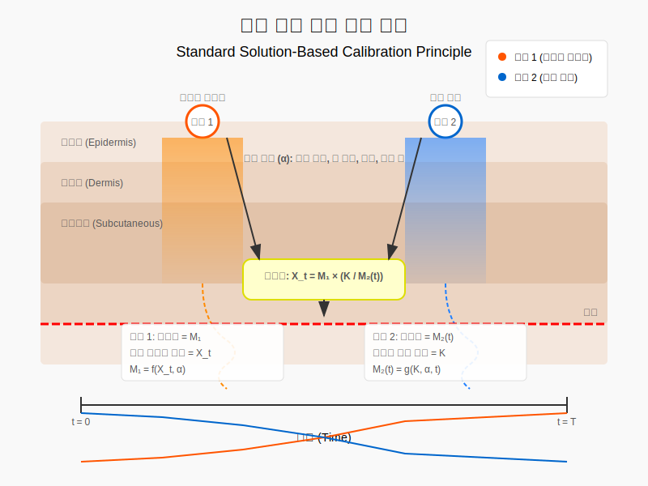
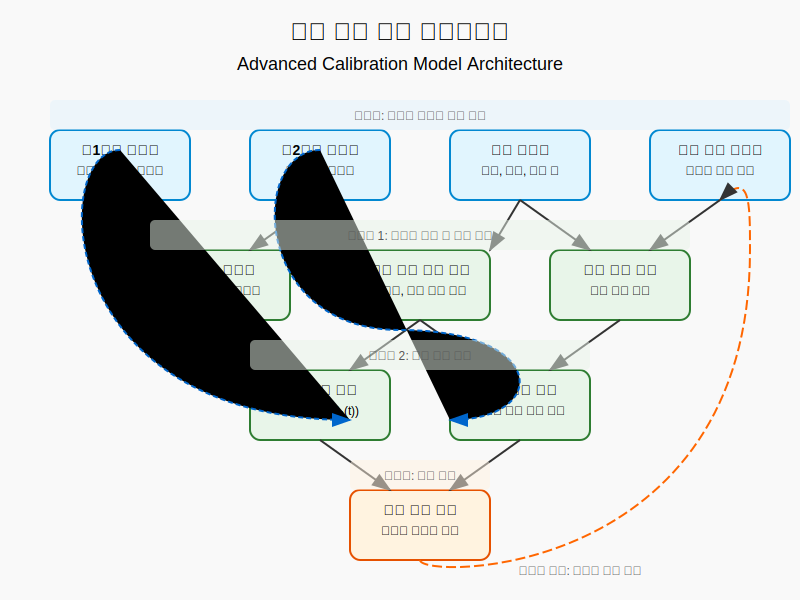

# 수학적 모델 및 증명

본 문서는 표준 용액을 이용한 비침습적 체외 혈당 모니터링의 수학적 원리와 증명을 상세히 다룹니다.

## 1. 문제 정의

비침습적 혈당 측정에서의 핵심 문제는 다음과 같이 정의할 수 있습니다:

- 땀 속 실제 포도당 농도: $X_t$ (미지의 값)
- 제1센서 측정값: $M_1$ (이상적으로는 $X_t$와 같아야 함)
- 제2센서에 적용된 알려진 표준 용액 농도: $K$
- 제2센서의 시간 $t$에서의 측정값: $M_2(t)$

땀을 통한 혈당 측정의 정확도를 향상시키는 것이 목표이며, 특히 피부 특성, 땀 분비 속도, 환경 요인 등의 변동성을 효과적으로 보정하는 것이 중요합니다.

## 2. 측정 모델

### 2.1 일반적인 측정 모델

비침습적 측정에서 센서 값은 다음과 같은 함수로 표현할 수 있습니다:

$$M_1 = f(X_t, \alpha)$$

여기서:
- $f$는 측정 함수
- $\alpha$는 다양한 요인을 포함하는 파라미터 벡터:
  - $\alpha_1$: 피부 투과도
  - $\alpha_2$: 땀 분비 속도
  - $\alpha_3$: 피부 온도
  - $\alpha_4$: 국소 혈류량
  - $\alpha_5$: 피부 pH
  - $\alpha_6$: 환경 온도
  - $\alpha_7$: 환경 습도

제2센서(표준 용액)의 경우:

$$M_2(t) = g(K, \alpha, t)$$

여기서 $g$는 시간에 따른 표준 용액의 농도 변화 함수입니다.

### 2.2 선형 근사 모델

단순화를 위해, 측정 함수 $f$와 $g$를 선형 모델로 근사할 수 있습니다:

$$M_1 \approx X_t \cdot (1 + \beta \cdot \alpha)$$

$$M_2(t) \approx K \cdot (1 + \gamma(t) \cdot \alpha)$$

여기서:
- $\beta$는 실제 포도당 측정에 대한 환경 요인의 영향 계수
- $\gamma(t)$는 시간에 따른 표준 용액 측정에 대한 환경 요인의 영향 계수

일반적으로 두 센서가 근접한 위치에 있을 때, 유사한 환경 요인의 영향을 받으므로 $\beta \approx \gamma(t)$로 가정할 수 있습니다.

## 3. 보정 방법론

### 3.1 비율 기반 보정

표준 용액의 초기 농도 $K$와 시간 $t$에서의 측정값 $M_2(t)$ 간의 비율을 계산하여 보정 계수를 도출합니다:

$$C(t) = \frac{K}{M_2(t)}$$

이 보정 계수를 제1센서 측정값에 적용하여 보정된 포도당 농도를 얻습니다:

$$X_{corrected} = M_1 \cdot C(t)$$

선형 모델 가정 하에서:
$$X_{corrected} = M_1 \cdot \frac{K}{M_2(t)} = \frac{X_t \cdot (1 + \beta \cdot \alpha) \cdot K}{K \cdot (1 + \gamma(t) \cdot \alpha)}$$

$\beta \approx \gamma(t)$ 일 때:
$$X_{corrected} \approx X_t$$

이러한 보정을 통해 환경 요인 $\alpha$에 관계없이 실제 포도당 농도 $X_t$에 근접한 측정이 가능해집니다.

### 3.2 변화율 기반 보정

시간에 따른 표준 용액의 변화율을 측정하여 더 정교한 보정이 가능합니다. 표준 용액의 변화율은 다음과 같이 정의됩니다:

$$R(t) = \frac{K - M_2(t)}{K}$$

이 변화율을 고려한 보정 함수:

$$X_{corrected} = \frac{M_1}{1 - R(t)} = \frac{M_1 \cdot K}{M_2(t)}$$

이는 앞서 도출한 비율 기반 보정과 수학적으로 동일한 결과를 제공합니다.

## 4. 확장된 복합 보정 모델

실제 환경에서는 다양한 요인이 비선형적으로 영향을 미칠 수 있습니다. 이를 고려한 복합 보정 모델은 다음과 같이 정의할 수 있습니다:

$$X_{corrected} = M_1 \cdot h(M_2(t_0), M_2(t_1), ..., M_2(t_n), \theta)$$

여기서:
- $h$는 다중 시점 표준 용액 측정값을 입력으로 받는 보정 함수
- $\theta$는 보정 함수의 파라미터 벡터

복합 보정 함수 $h$는 다음과 같이 설계할 수 있습니다:

$$h(M_2(t_0), M_2(t_1), ..., M_2(t_n), \theta) = \frac{K}{M_2(t_n)} \cdot (1 + \theta_1 \cdot \frac{dM_2}{dt} + \theta_2 \cdot \frac{d^2M_2}{dt^2})$$

이 함수는 표준 용액의 변화 속도와 가속도까지 고려하여 더 정교한 보정이 가능합니다.

## 5. 다변수 환경 요인 모델

실제 생리학적 환경에서는 여러 요인이 독립적으로 영향을 미칠 수 있습니다. 이를 고려한 다변수 모델은 다음과 같이 표현할 수 있습니다:

$$M_1 = X_t \cdot \prod_{i=1}^{n} (1 + \beta_i \cdot \alpha_i)$$

$$M_2(t) = K \cdot \prod_{i=1}^{n} (1 + \gamma_i(t) \cdot \alpha_i)$$

각 요인별 보정 계수는 다음과 같이 정의할 수 있습니다:

$$C_i(t) = \frac{1 + \beta_i \cdot \alpha_i}{1 + \gamma_i(t) \cdot \alpha_i}$$

그리고 최종 보정 함수는:

$$X_{corrected} = M_1 \cdot \prod_{i=1}^{n} C_i(t)$$

이 다변수 모델은 특히 온도, 습도, pH 등 다양한 환경 요인이 서로 다른 방식으로 영향을 미치는 경우에 유용합니다.

## 6. 실험적 증명

특허에 기재된 실험 데이터를 통해 보정 방법의 효과를 검증할 수 있습니다:

### 샘플 1의 경우:
- 표준 포도당 용액: 100mg/dL → 90mg/dL (300초 후)
- 변화율 $R = \frac{100-90}{100} = 0.1$
- 측정된 포도당 값: 125mg/dL
- 보정 후: $\frac{125}{1-0.1} = \frac{125}{0.9} \approx 138.9$ mg/dL
- 실제 혈당: 135mg/dL (오차율: ~2.9%)

### 샘플 2의 경우:
- 표준 포도당 용액: 100mg/dL → 84mg/dL (300초 후)
- 변화율 $R = \frac{100-84}{100} = 0.16$
- 측정된 포도당 값: 124mg/dL
- 보정 후: $\frac{124}{1-0.16} = \frac{124}{0.84} \approx 147.6$ mg/dL
- 실제 혈당: 113mg/dL (오차율: ~30.6%)

샘플 2의 경우 단순 선형 모델로는 충분한 보정이 이루어지지 않아, 앞서 제안한 복합 보정 모델이 필요함을 시사합니다.

## 7. 보정 알고리즘의 일반화

다양한 상황에서의 보정을 위한 일반화된 알고리즘은 다음 단계를 따릅니다:

1. 표준 용액의 시간에 따른 측정값 수집: $M_2(t_0), M_2(t_1), ..., M_2(t_n)$
2. 시간에 따른 변화 패턴 분석: 기울기, 곡률, 안정화 시간 등
3. 피부 특성 및 환경 요인 파라미터 추정: $\hat{\alpha} = \phi(M_2(t_0), M_2(t_1), ..., M_2(t_n))$
4. 최적 보정 함수 선택: 선형, 비선형, 다변수 등
5. 보정 함수 적용: $X_{corrected} = M_1 \cdot C(\hat{\alpha})$

이 일반화된 알고리즘은 다양한 개인별, 부위별, 환경별 조건에서 일관된 측정 정확도를 제공할 수 있습니다.

## 8. 결론

표준 용액 접근법은 비침습적 혈당 모니터링의 핵심 문제인 변동성을 체계적으로 해결할 수 있는 수학적으로 검증된 방법입니다. 특히 다음과 같은 이점을 제공합니다:

1. 개인별, 부위별 차이에 관계없이 일관된 정확도
2. 실시간 환경 변화에 대한 동적 보정
3. 측정 시스템의 자체 검증 기능
4. 다양한 생리적 조건에 대한 적응성

이러한 수학적 기반을 통해, 표준 용액 접근법은 비침습적 포도당 측정의 신뢰성과 정확성을 본질적으로 향상시킬 수 있습니다.
